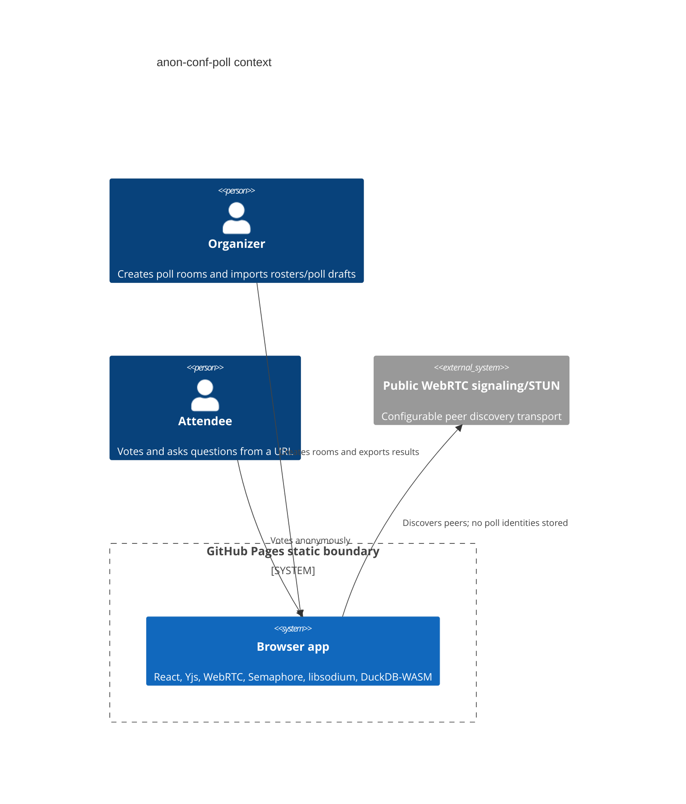

# anon-conf-poll

Live GitHub Pages site: https://baditaflorin.github.io/anon-conf-poll/

GitHub repository: https://github.com/baditaflorin/anon-conf-poll

Support development: https://www.paypal.com/paypalme/florinbadita

Static, anonymous live polling with CRDT sync, zk one-vote proofs, and local analytics.

## Quickstart

```sh
npm install
make install-hooks
make dev
make test
make build
```

## What It Does

`anon-conf-poll` lets attendees vote and submit Q&A from a shared URL. Poll state syncs between browsers with Yjs over WebRTC, eligibility is checked with Semaphore-style zero-knowledge membership proofs and per-poll nullifiers, and organizers can import real roster/poll files, export results, save state, and query results locally with DuckDB-WASM. The app is designed for GitHub Pages first: no application server, no attendee identity database, and no secrets in the frontend.


## Architecture



More detail lives in `docs/architecture.md`, `docs/adr/`, and `docs/mesh-architecture.md` (end-to-end signaling + TURN walkthrough).

## Self-host the infrastructure

The browser app is the only thing GitHub Pages serves. The runtime mesh needs three small infrastructure pieces, each in its own repo, each independently deployable, each documented from zero on a fresh VPS:

| Repo | Role | Endpoint the app uses |
|---|---|---|
| [signaling-server](https://github.com/baditaflorin/signaling-server) | y-webrtc WebSocket signaling | `wss://YOUR_HOST/ws` |
| [turn-token-server](https://github.com/baditaflorin/turn-token-server) | Issues short-lived HMAC TURN credentials | `https://YOUR_HOST/credentials` |
| [coturn-hetzner](https://github.com/baditaflorin/coturn-hetzner) | TURN relay for cross-NAT WebRTC | `turn:YOUR_HOST:3478` (used directly by the browser, not via nginx) |

All three include health endpoints, Prometheus metrics, nginx example configs, and bootstrap scripts. The total cost of running all three on the same Hetzner CX22 is ~4 €/month.

To point this app at your own infrastructure, edit `src/shared/config.ts` (`signalingUrl`) and `src/features/sync/iceConfig.ts` (`loadTurnTokenUrl` default), then rebuild. Or set them at build time:

```sh
VITE_WEBRTC_SIGNALING=wss://signaling.example.com/ws \
VITE_TURN_TOKEN_URL=https://turn.example.com/credentials \
make build
```

Background on how the mesh actually connects two browsers: [docs/mesh-architecture.md](docs/mesh-architecture.md). Why the default `wss://signaling.yjs.dev` doesn't work (and how the binary-frame bug ate three days of debugging): [docs/postmortem-phase4-mesh-deadlock.md](docs/postmortem-phase4-mesh-deadlock.md).

## Verified Features

- Live static app: https://baditaflorin.github.io/anon-conf-poll/
- Public repository link and PayPal link are visible in the app header.
- Version and source commit are visible in the app header.
- Room URLs share the room manifest with no runtime backend.
- Roster import supports paste, file picker, drag/drop, and multi-file CSV/TXT/JSON routing.
- Poll draft import supports prose, bullets, and spreadsheet-style CSV.
- Invite import supports raw tokens, wrapped tokens, JSON/string wrappers, clipboard read, and URL-like input.
- State export/import saves room setup, drafts, selected options, local invite, activity, and raw sync records in versioned JSON.
- Results export supports provenance JSON and vote-row CSV, both downloadable and copyable.
- DuckDB-WASM runs locally in the browser for result summaries.
- `Start fresh` clears local saved state and creates a new room.

## Limitations

- WebRTC mesh reliability depends on browser networking and the configured signaling service. Very large conferences may need a later relay/TURN/signaling topology.
- Vote CSV contains vote rows only. Use results JSON for provenance, room metadata, roster/poll inference summaries, and Q&A.
- Room URLs are convenient for normal manifests but have browser URL-size limits. Use state JSON for larger or archival workflows.
- The app has a web app manifest, but no service worker offline cache guarantee yet.
- Full proof generation downloads large Semaphore artifacts on first use; smoke tests cover the static app, import/export paths, and DuckDB initialization rather than every proving artifact in Playwright.

## Deployment

This is a Mode A static site. Vite builds directly into `docs/`, which GitHub Pages serves from `main /docs`.

```sh
make build
make pages-preview
```

## Security

Never commit secrets. The frontend contains only public configuration and static assets. See `SECURITY.md` for disclosure guidance and `docs/privacy.md` for privacy details.
