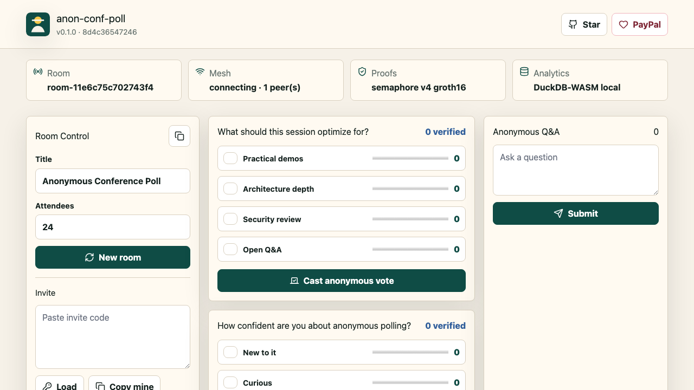
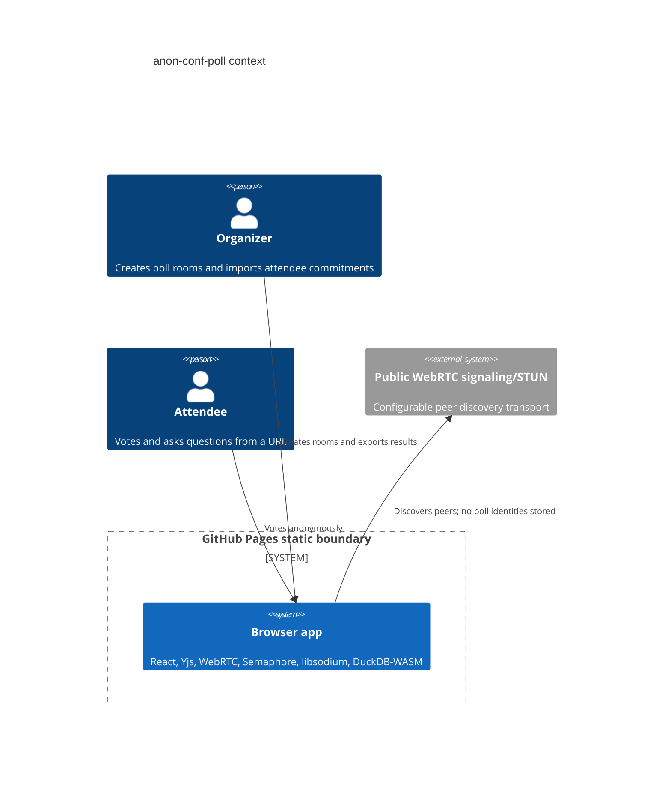

# anon-conf-poll

Live GitHub Pages site: https://baditaflorin.github.io/anon-conf-poll/

GitHub repository: https://github.com/baditaflorin/anon-conf-poll

Support development: https://www.paypal.com/paypalme/florinbadita

Static, anonymous live polling with CRDT sync, zk one-vote proofs, and local analytics.

## Quickstart

```sh
npm install
make install-hooks
make dev
make test
make build
```

## What It Does

`anon-conf-poll` lets attendees vote and submit Q&A from a shared URL. Poll state syncs between browsers with Yjs over WebRTC, eligibility is checked with Semaphore-style zero-knowledge membership proofs and per-poll nullifiers, and organizers can export/query results locally with DuckDB-WASM. The app is designed for GitHub Pages first: no application server, no attendee identity database, and no secrets in the frontend.



## Architecture



More detail lives in `docs/architecture.md` and `docs/adr/`.

## Deployment

This is a Mode A static site. Vite builds directly into `docs/`, which GitHub Pages serves from `main /docs`.

```sh
make build
make pages-preview
```

## Security

Never commit secrets. The frontend contains only public configuration and static assets. See `SECURITY.md` for disclosure guidance and `docs/privacy.md` for privacy details.
