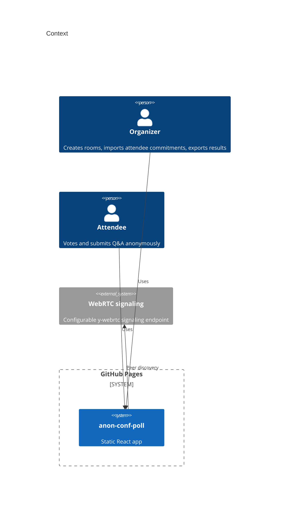
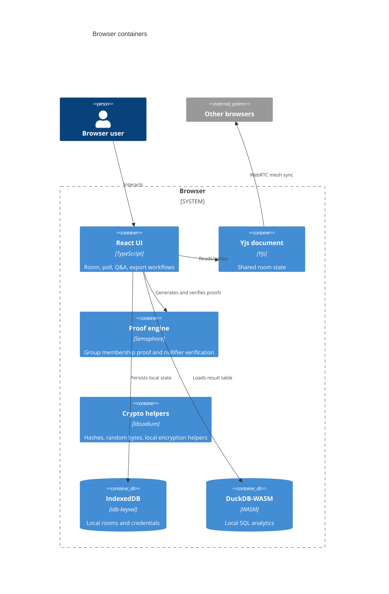

# Architecture

`anon-conf-poll` is a Mode A static application. GitHub Pages serves the shell, and every runtime capability executes inside the attendee or organizer browser.

## Context

## Container

## Boundaries

- The frontend bundle is public and contains no secrets.
- Credentials are generated or imported locally.
- Votes are accepted only after nullifier and group membership checks.
- Exports are generated locally; no central analytics service receives attendee data.
